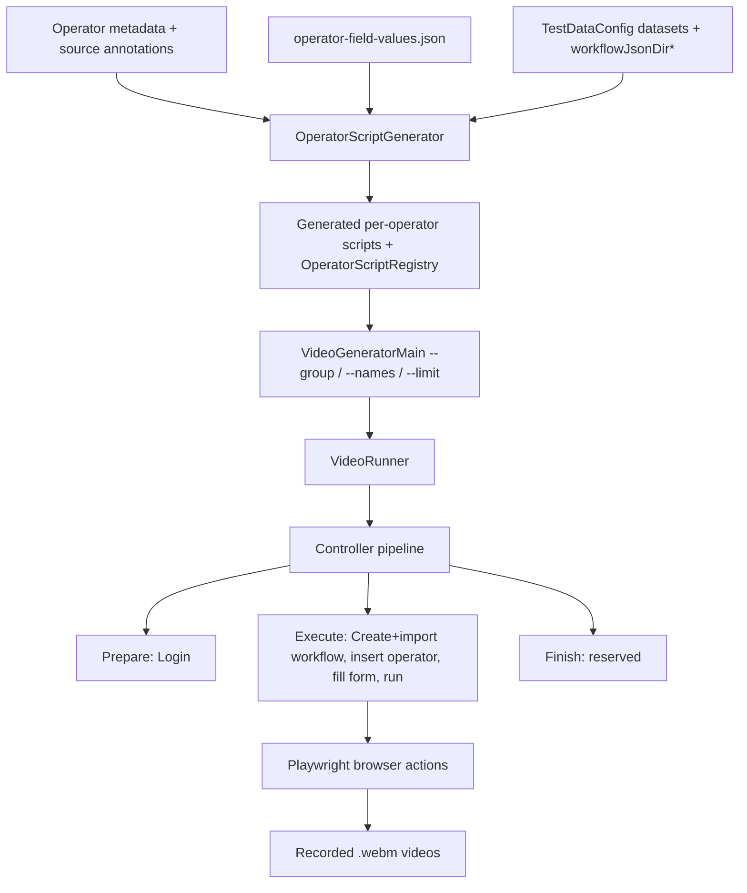
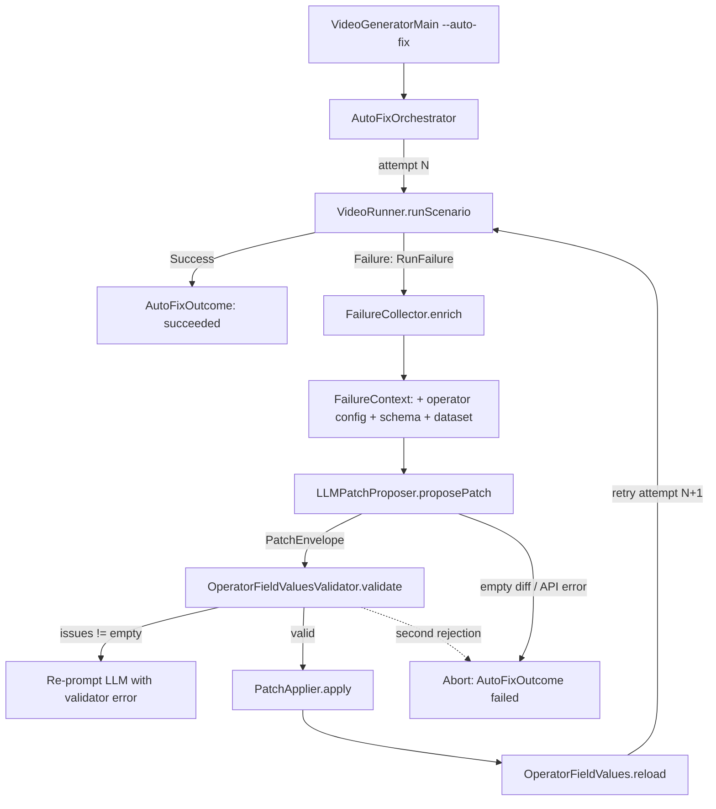

# Texera Docs: Video Generator

Automated pipeline for generating operator demo videos and documentation pages using Playwright.

Each operator gets a self-contained scenario: create workflow, import template, insert operator, fill form values, run execution, open result panel, and save a `.webm` recording.

---

## 1. Prerequisites

- Texera running locally at `http://localhost:4200`
- A registered account (default: `texera` / `texera`)
- sbt installed
- Playwright Chromium browser installed:
  ```bash
  sbt 'Docs/runMain com.microsoft.playwright.CLI install chromium'
  ```

---

## 2. Instructions

### Step 1: Upload the Dataset

Upload the sample dataset into Texera via the Dashboard UI:

1. Go to `http://localhost:4200` and log in
2. Navigate to **Datasets** and create a new dataset named **`sample-dataset`** at version **`v1`**
3. Upload the following files into the dataset:
   - `movies.csv` — 15 columns: name, rating, genre, year, released, score, votes, director, writer, star, country, budget, gross, company, runtime
   - `movie_tree.csv` — 21 columns: edge_list, category, subcategory, title, revenue, budget, pos_x, pos_y, vec_u, vec_v, date, open_week, peak_week, low_week, close_week, prod_start, prod_end, task, predicted, upper_ci, lower_ci

> **If you use a custom dataset name or version**, update:
> - `docs/.../config/TestDataConfig.scala` — `datasets("test1")` and `datasets("test2")` entries
> - `docs/.../config/sample.json` — workflow template references the dataset by name
> - `docs/.../config/sample_tree.json` — same, for movie_tree.csv
> - `docs/.../config/sample_join.json` — same, for join operators
> - `docs/.../config/sample_ML.json` — same, for ML operators

### Step 2: Generate Playwright Scripts

```bash
sbt 'Docs/runMain org.apache.texera.docs.scripts.OperatorScriptGenerator'
```

Scans all registered operators and writes one `<OperatorType>Script.scala` per operator under `docs/.../scripts/operators/<Group>/<Subgroup>/`, plus `OperatorScriptRegistry.scala`.

Re-run after: adding a new operator, changing operator group structure, or modifying `operator-field-values.json` dataset assignments.

### Step 3: Run the Video Generator

```bash
# Run ALL operators
sbt 'Docs/runMain org.apache.texera.docs.VideoGeneratorMain'

# Run a specific group
sbt 'Docs/runMain org.apache.texera.docs.VideoGeneratorMain --group="Data Input"'

# Run specific operators by name
sbt 'Docs/runMain org.apache.texera.docs.VideoGeneratorMain --names=BarChart,PieChart'

# Combine filters
sbt 'Docs/runMain org.apache.texera.docs.VideoGeneratorMain --group=Visualization --names=BarChart'

# Cap the count
sbt 'Docs/runMain org.apache.texera.docs.VideoGeneratorMain --group=Sklearn --limit=5'
```

| Flag | Description | Example |
|------|-------------|---------|
| `--group=<name>` | Filter by operator category (case-insensitive, strips non-alphanumeric) | `--group="Data Input"` |
| `--names=A,B,C` | Filter by operator **user-friendly name** (not operator type), comma-separated | `--names="Bar Chart,Pie Chart"` |
| `--limit=N` | Cap the number of videos generated | `--limit=3` |

Common group names: `Data Input`, `Data Cleaning`, `Visualization Basic`, `Visualization Advanced`, `Visualization Statistical`, `Visualization Scientific`, `Visualization Financial`, `Machine Learning`, `Sklearn`, `Sklearn Training`, `Search`, `Utilities`, `Join`, `Set`

Videos are saved to `docs/generated/videos-demo/` as `.webm` files.

---

## 3. Validation and Debugging

```bash
# Compile
sbt "Docs/compile"

# Validate JSON config syntax
python3 -m json.tool docs/src/main/scala/org/apache/texera/docs/config/operator-field-values.json > /dev/null

# Validate config keys, required fields, and column types against operator schemas
sbt 'Docs/runMain org.apache.texera.docs.scripts.OperatorFieldValuesValidator'

# Debug mode: verbose form-fill logging
TEXERA_DOCS_DEBUG=true sbt 'Docs/runMain org.apache.texera.docs.VideoGeneratorMain --names="Bar Chart"'
```

---

## 4. Architecture

### High-Level Flow



### Core Files

| File | Responsibility |
|------|----------------|
| `scripts/OperatorScriptGenerator.scala` | Generates one script per operator from metadata. Decides workflow template, drag strategy, dataset selection, auto-connect wiring |
| `config/operator-field-values.json` | Per-operator property recommendations. Supports scalar, boolean, array, nested-object-array values |
| `controllers/Controllers.scala` | Playwright controller layer: login, navigation, operator insertion, form filling, execution, result panel, repeat-array handling |
| `config/TestDataConfig.scala` | Environment defaults: base URL, datasets, recording config, JSON template paths |
| `orchestrator/VideoRunner.scala` | Runs scenario list, records each operator video via Playwright Chromium |
| `VideoGeneratorMain.scala` | Unified entry point with `--group`/`--names`/`--limit` filtering and runtime skip list |
| `scripts/OperatorFieldValues.scala` | Loads operator-field-values.json; strips meta-keys (`dataset`) before form fill; provides `datasetKey()` for template selection |
| `scripts/OperatorFieldValuesValidator.scala` | Schema validation: checks config keys against operator metadata, column types against dataset schemas |

---

## 5. Execution Flow (Per Operator)

### OperatorScript Trait

```scala
trait OperatorScript {
  def operatorName: String    // "Bar Chart"
  def category: String        // "Basic"
  def outputFileName: String  // "bar-chart_demo.webm"

  def prepare(ctx): Unit      // login
  def execute(ctx): Unit      // core operations
  def finish(ctx): Unit       // cleanup (currently no-op)
}
```

### Phase Breakdown

1. **Prepare** — `LoginControllerBuilder.login()`
2. **Execute**
   - `createNewWorkflow()` — navigates to a fresh workflow
   - `importWorkflow(template)` — imports the appropriate JSON template; auto-cleans stale operators if any remain on canvas
   - `insertViaDrag(operatorName)` — drags operator from sidebar, auto-connects to anchor operator
   - Dataset selection (Data Input operators) — `DatasetControllerBuilder` opens modal, selects dataset/version/file
   - Form fill — `FormControllerBuilder.fillFieldJsonValues()` from operator-field-values.json; falls back to `autoFillFields()` if no config entry
   - `runWorkflowAndWait()` — ensures computing unit ready, clicks Run, waits for state transition back to `Run`
   - `openResultPanel()` — expands result panel for video capture; avoids toggling off "remove view result"
3. **Finish** — no-op (reserved for future post-actions)

### Typical Flow: Visualization Operator

```
1. LoginControllerBuilder.login("texera", "texera")

2. NavigationControllerBuilder
   ├─ createNewWorkflow()
   └─ importWorkflow("config/sample.json")      → CSVFileScan template

3. OperatorControllerBuilder
   └─ insertViaDrag("Bar Chart", operatorType="BarChart",
        dragNextTo="CSVFileScan-operator-", autoConnectToAnchor=true)

4. FormControllerBuilder
   └─ fillFieldJsonValues(configured)            → from operator-field-values.json

5. ExecutionControllerBuilder
   ├─ enableViewResult()
   ├─ runWorkflowAndWait()
   └─ openResultPanel()
```

### Typical Flow: Join Operator (2 inputs)

```
1. LoginControllerBuilder.login("texera", "texera")

2. NavigationControllerBuilder
   ├─ createNewWorkflow()
   └─ importWorkflow("config/sample_join.json")  → CSV → Split (2 outputs)

3. OperatorControllerBuilder
   └─ insertViaDrag("Hash Join",
        dragNextTo="Split-operator-", autoConnectToAnchor=true,
        fromPortIndex=0, toPortIndex=0,
        connectAdditionalFrom="Split-operator-",
        connectAdditionalFromPortIndex=1, connectAdditionalToInputIndex=1)

4. FormControllerBuilder
   └─ fillFieldJsonValues(configured)

5. ExecutionControllerBuilder
   ├─ enableViewResult()
   ├─ runWorkflowAndWait()
   └─ openResultPanel()
```

---

## 6. Controller Builders

All builders inherit from `ControllerBuilder`, accumulate `ControllerStep` instances, then call `execute()` to run them sequentially.

```
ControllerBuilder (abstract)
  │
  ├─ LoginControllerBuilder        → login(), logout()
  │
  ├─ NavigationControllerBuilder   → createNewWorkflow(), importWorkflow(), cleanWorkflow()
  │
  ├─ OperatorControllerBuilder     → insertViaDrag(), connectOperators(), selectOperatorOnCanvas()
  │    └─ tryAutoConnect()          → SVG port drag-to-connect
  │    └─ findNodeByType()          → find operator node on canvas by type/name/label
  │    └─ collectPortCenters()      → extract port positions from JointJS SVG
  │
  ├─ DatasetControllerBuilder      → datasetName(), datasetVersion(), file(), versionOnly()
  │    └─ open dataset modal → select dataset → select version → [select file] → confirm
  │
  ├─ FormControllerBuilder         → fillFieldJsonValues(), autoFillFields(), fillField()
  │    └─ resolveField()            → locate formly-field elements by label matching
  │    └─ fillArrayItemsNow()       → expand and fill array fields
  │    └─ FormHelpers               → tryFillSelect(), tryFillText(), trySetBoolean()
  │    └─ LLMFormRecovery           → AI-assisted field location fallback (optional)
  │
  └─ ExecutionControllerBuilder    → runWorkflowAndWait(), openResultPanel(), enableViewResult()
       └─ ensureComputingUnitReady() → create or select computing unit
```

### Connection Strategy by Operator Type

| Type | Strategy |
|------|----------|
| Visualization / Data Cleaning (1 input) | `dragNextTo = Some("CSVFileScan-operator-")`, auto-connect |
| Join / Set ops (2+ inputs) | `dragNextTo = Some("Split-operator-")`, auto-connect port 0, connect additional from Split output 1 → port 1 |
| ML (1 input) | `dragNextTo = Some("Split-operator-")`, auto-connect, `yOffset = -110.0` |
| ML (2+ inputs, train/test) | `dragNextTo = Some("Split-operator-")`, port 0 → train, additional port 1 → test |
| Data Input | `canvasPosition = (0.30, 0.30)`, standalone placement |

### Dataset Selection Modes

`DatasetControllerBuilder` supports two modes:
- **File mode** (default) — opens "Select File" modal, selects dataset → version → file in tree → confirm. Used by `CSVFileScan`, `ArrowSource`, `JSONLFileScan`, `CSVOldFileScan`.
- **Version-only mode** (`.versionOnly()`) — opens "Select Dataset" modal, selects dataset → version → confirm (no file tree). Used by `FileLister`.

---

## 7. Form Filling Strategy

### Field Resolution

For each config key, `labelCandidates()` builds candidate labels from:
1. Schema titles from operator metadata (most authoritative, including nested schema traversal)
2. Targeted alias fallbacks for nested configs (e.g., `originalAttribute` → `Attribute`)
3. Pretty-printed camelCase key as last resort

Then resolves the deepest visible `formly-field` with a matching label.

### Control Types

Fills by detected control — `nz-select` dropdowns, `input`/`textarea` text fields, `checkbox`/`switch` booleans. Booleans are filled first (they often toggle visibility of dependent fields).

### Array / Nested Object Handling

`fillFieldJsonValues` detects array-of-object values and calls `fillArrayItemsNow`:
- clicks `+` to create repeat rows as needed
- resolves row/subfield scopes
- fills each subfield value
- uses retry logic for async dropdown availability after schema propagation

Example config patterns:
```json
{
  "Filter": {
    "predicates": [
      { "attribute": "score", "condition": ">", "value": "7.0" }
    ]
  },
  "Projection": {
    "isDrop": false,
    "attributes": [
      { "originalAttribute": "name", "alias": "movie_name" }
    ]
  },
  "ContinuousErrorBands": {
    "dataset": "test2",
    "bands": [
      { "x": "revenue", "y": "predicted", "yUpper": "upper_ci", "yLower": "lower_ci" }
    ]
  }
}
```

---

## 8. VideoRunner

- **`loginOnce`**: First login to obtain `storageState` (session cookie JSON). If login fails, falls back to per-scenario Prepare login.
- **`generateSingleVideo`**: For each scenario, creates a new BrowserContext with recording enabled.
  - If storageState exists, Prepare steps (login) are skipped
  - Recording dimensions: **1440 x 900**, slowMo: **400ms**
  - Result screen hold time: **5000ms**
  - Video saved as Playwright's auto-named `.webm`, then renamed to `{operator-slug}_demo.webm`

---

## 9. OperatorScriptGenerator

Automatically generates `XxxScript.scala` files for each registered operator.

```
OperatorMetadataGenerator.allOperatorMetadata
        │
        ▼
   foreach operator:
        ├─ Determine group (Visualization / ML / DataCleaning / DataInput)
        ├─ Pick workflow JSON template
        ├─ Check if data input operator needs dataset selection
        ├─ Compute autoFillKeys from schema (required + autofill-annotated fields)
        ├─ Generate dragNextTo / autoConnect parameters
        └─ Output .scala file to operators/{Category}/XxxScript.scala
```

Also regenerates `OperatorScriptRegistry.scala` with all script objects.

---

## 10. Workflow Templates

| Template | Source Setup | Used By |
|----------|-------------|---------|
| `sample.json` | Single CSVFileScan → movies.csv | Most visualization, data cleaning, utilities |
| `sample_tree.json` | Single CSVFileScan → movie_tree.csv | Operators with `"dataset": "test2"` (hierarchy, timeline, financial charts) |
| `sample_join.json` | CSVFileScan → Split (2 outputs) | Join and set operators (2-input) |
| `sample_ML.json` | CSVFileScan → Split (train/test) | ML training and prediction operators |

---

## 11. Configuration

### Adding a New Operator

1. Add the operator's form field values to `operator-field-values.json` under the operator type key
   - Use column names from the dataset schema (see `"datasets"` section at the top of the file)
   - Add `"dataset": "test2"` if the operator needs movie_tree.csv columns (hierarchy, timestamps, CI bands, vectors)
2. Re-run the script generator (Step 2)
3. Test: `sbt 'Docs/runMain org.apache.texera.docs.VideoGeneratorMain --names="Operator Name"'`

### Runtime Skip List

`VideoGeneratorMain` excludes operators that crash or time out on the current datasets:
- Gaussian Naive Bayes — rejects sparse matrices from CountVectorizer/TfidfTransformer
- Linear Regression — PolynomialFeatures fails on text columns without countVectorizer
- Gradient Boosting / Training: Gradient Boosting — too slow on high-dim sparse TF-IDF

### Dataset Schemas

**test1** (`movies.csv`): name(string), rating(string), genre(string), year(integer), released(string), score(double), votes(integer), director(string), writer(string), star(string), country(string), budget(double), gross(double), company(string), runtime(double)

**test2** (`movie_tree.csv`): edge_list(string), category(string), subcategory(string), title(string), revenue(double), budget(double), pos_x(double), pos_y(double), vec_u(double), vec_v(double), date(timestamp), open_week(double), peak_week(double), low_week(double), close_week(double), prod_start(timestamp), prod_end(timestamp), task(string), predicted(double), upper_ci(double), lower_ci(double)

---

## 12. AutoFix Agent (WIP)

> **Status: work in progress.** Triggered by `--auto-fix` on the `VideoGeneratorMain` CLI. The pieces below are implemented and compile, but the actual LLM-proposed patches have only been exercised on a handful of operators so far. Treat the contracts as draft and expect both the prompt and the hint vocabulary to evolve as we observe more failure modes.

The AutoFix layer wraps `VideoRunner` so that a scenario failure no longer means "give up and write the operator into `unfixed.json`". Instead, the layer tries to remediate by asking Claude (via the Anthropic Messages API) to propose a minimal JSON-patch against `operator-field-values.json`, applies the patch in place, then reruns the same scenario — up to `--max-attempts` (default 3) times.

### High-Level Flow



### Module Layout (`docs/.../autofix/`)

| File | Responsibility |
|---|---|
| `AutoFixOrchestrator.scala` | Per-scenario retry loop: snapshot config → run → on failure, propose+validate+apply patch → retry → on success, return outcome. Restores snapshot when giving up so a bad patch doesn't pollute the JSON. |
| `FailureCollector.scala` | Turns a raw `RunFailure` into a `FailureContext` by attaching the operator's current config block, the operator's JSON schema, and the dataset schema. This is what the LLM sees. |
| `LLMPatchProposer.scala` | Calls Anthropic Messages API (`ANTHROPIC_API_KEY` env required). System prompt constrains the model to return a JSON-pointer `diff` array; user message bundles the exception + console errors + config + schema. Parses the response into a `PatchEnvelope`. |
| `PatchApplier.scala` | Pure JSON manipulation: snapshot / dryRun / apply / restore against `operator-field-values.json`. Implements a small subset of RFC 6902 (add/remove/replace, "-" array append). |
| `OperatorFieldValuesValidator.scala` | Reused from the offline validator — checks the proposed patch's result against operator schema (key, type, dataset column matches). The orchestrator does **dryRun → validate → re-prompt or apply**, so the LLM gets one feedback round before its patch is rejected outright. |
| `PlaywrightConfigProbe.scala` | (placeholder for runtime probing; currently unused — see "Limitations" below) |
| `AutoFixTypes.scala` | Case classes: `RunFailure`, `FailureContext`, `PatchOp`, `PatchEnvelope`, `AttemptRecord`, `AutoFixOutcome`. |

### What the LLM Sees per Attempt

```
Operator type: SklearnLinearRegression
Operator name: Linear Regression
Failing step: Run Workflow And Wait
Exception: java.lang.RuntimeException: Workflow execution did not finish within 240000ms. Run button text='Pause'.
Browser console errors:
<…top 30, de-duped…>
Texera workflow error: <if extracted from .workflow-execution-error / .ant-message-error / texera-error-frame>

Dataset key: test1
Dataset schema: [{ "name": "score", "type": "double" }, …]

Current operator config: { "target": "score", "degree": 1 }
Operator JSON schema (relevant subset): { "title": …, "properties": …, "attributeTypeRules": … }

(If a prior attempt was validator-rejected, the rejection message is appended and the model is asked to re-propose.)
```

The model is told to return **only** a JSON object with `operatorType`, `reasoning`, `confidence`, and a `diff` array of `{op, path, value?}` ops whose paths are RFC 6902 pointers relative to the operator's config object (so `/value`, not `/operators/BarChart/value`).

### `_controllerHints` — Letting the Agent Patch UI Bindings

Most operator failures are value-level (wrong column, wrong type, missing required field), which `operator-field-values.json` can express directly. But some failures are controller-level — the operator card has been renamed in the sidebar, a form field's label drifted, or the Run button got a different selector after a UI refactor. The agent can't rewrite Scala, so we expose a small set of UI-binding overrides under a reserved `_controllerHints` meta-key:

```jsonc
{
  "operators": {
    "BarChart": {
      "value": "score",
      "_controllerHints": {
        "operatorSidebarText": "Bar Chart",
        "formFieldLabels": { "value": "Y-Value Column" },
        "runButtonSelector": "[data-testid='workflow-run-button']"
      }
    }
  }
}
```

| Hint key | Read by | Behavior |
|---|---|---|
| `operatorSidebarText` | `OperatorControllerBuilder.insertViaDrag` | Overrides the text typed into the sidebar search input when locating the operator card. Default = `operatorName` from the script. |
| `formFieldLabels.<configKey>` | `FormControllerBuilder.labelCandidates` | Prepended as highest-priority candidate label for that field, ahead of metadata titles and the pretty-printed key. |
| `runButtonSelector` | `ExecutionControllerBuilder.runButton` | OR'd into the locator selector as `"$hint, #run-button"` so a bad hint cannot remove the `#run-button` fallback. |

Lookup is keyed on the **canonical** `operatorType` (e.g. `SklearnLinearRegression`), not the friendly `operatorName`. This is set on `ControllerContext.currentOperatorType` defensively at the start of every scenario in `VideoRunner.runScenario` (so hints apply even if a script skips `insertViaDrag`), with `insertViaDrag` redundantly reinforcing it when called.

`_controllerHints` is registered in `OperatorFieldValues.metaKeys` and `OperatorFieldValuesValidator.metaKeys`, so the form-fill path strips it before iterating UI fields and the schema validator ignores it instead of rejecting it as an unknown key.

The LLM prompt explicitly enumerates the three hint paths and the trigger conditions under which it should consider patching them (e.g. "Cannot find operator source" → `operatorSidebarText`, "Field not found: <key>" → `formFieldLabels/<key>`). The model is told to use a hint **only** when a value-level fix won't address the symptom.

### Failure-Detection Hardening (related to AutoFix)

For the agent to do useful work, the upstream scenario has to actually **report** a failure when one happens. Earlier the scenario code had several silent-pass paths that masked real Texera-side errors as "success" — defeating the entire retry loop. The current state:

| Path | Old behavior | New behavior |
|---|---|---|
| `runWorkflowAndWait` hits `timeoutMs` with button still on `Pause` | `println` + `return` (silent success) | Throws `RuntimeException("Workflow execution did not finish within …ms…")` — agent can see the operator is stuck and propose smaller-data / fewer-features patches. |
| Default `timeoutMs` | 120s | 240s — fewer false negatives from legitimately slow workflows; the new throw above provides the safety net for genuinely stuck runs. |
| Compilation error visible (`Static Error` / `COMPILATION_ERROR` text on page) | Logged and returned silently | Throws `RuntimeException("Workflow compilation error: <message>")` with the extracted text. |
| Result panel opens with no frames (`<h4>No results available to display.</h4>`) | Not checked | `assertPanelHasContent` throws — workflow ran but produced no output. |
| Result panel opens with `texera-error-frame` content | Not checked | `assertPanelHasContent` throws — surfaces the first error-message text into the exception. |

These selectors are derived from real Texera frontend templates (`result-panel.component.html`, `error-frame.component.html`); earlier drafts used invented class names and have been corrected.

### Group-Level Run Report

`VideoGeneratorMain` prints a structured report at the end of an `--auto-fix` run that breaks results into three buckets:

```
══════════════════════════════════════════════════════════════════════
  AutoFix Run Report
══════════════════════════════════════════════════════════════════════
  group:   Sklearn
  total:   28
  ✓ succeeded: 25    ✗ failed: 3
──────────────────────────────────────────────────────────────────────
  ✗ Failed:
    - Sklearn Prediction                       (3/3 attempts)  TimeoutError: …
  ──────────────────────────────────────────────────────────────────
  ✓ Succeeded on attempt 1: 23
  ──────────────────────────────────────────────────────────────────
  ✓ Succeeded after LLM patch:
    - Gradient Boosting                        (2 attempts, 1 patch)
══════════════════════════════════════════════════════════════════════
```

The "Succeeded after LLM patch" bucket is the key metric for whether the agent is actually earning its keep, vs. the runs that would have passed without it.

### Limitations / Open Questions (WIP)

1. **API key plumbing.** `LLMPatchProposer` reads `ANTHROPIC_API_KEY` from `sys.env`. Setting it only in an interactive shell isn't enough — `sbt` started from a non-inheriting parent (e.g. via Claude Code's Bash tool) won't see it. Persist in `~/.zshrc` / equivalent.

2. **Detection is conservative.** `assertPanelHasContent` only fires on **explicit** empty-state / error-frame signals. An operator whose chart silently renders garbage (wrong x-axis, empty bars but the SVG is non-empty) will still be marked success. Adding a positive check (e.g., "table must have ≥1 row" or "chart must have non-empty data binding") is on the list, but each operator's UI differs, so we want examples of false positives first.

3. **Structural failures are out of scope.** `SklearnPrediction` / `SklearnTesting` need an upstream `SklearnTraining*` operator to produce a `model` column; the current `sample_ML.json` template can't supply it. No value-level patch will fix this, and the agent currently can't add operators to the template either. Either treat as runtime-skip-list, or build a `sample_ML_with_training.json`.

4. **`PlaywrightConfigProbe` is a placeholder.** Eventually the idea is for the agent to **read** UI state (visible labels on the page, sidebar contents) as part of the failure context, not just static schema. Not implemented yet.

5. **Prompt drift.** The `_controllerHints` path names are hardcoded in `LLMPatchProposer.systemPrompt`. Adding new hints requires syncing both the controller wiring and the prompt — easy to forget. Consider extracting a hint registry.

6. **Single-pass design.** A two-pass workflow ("run the whole group, collect real failures, second pass: only retry those with the agent") would amortize the cost of slow first-pass runs and isolate agent-driven changes for review. There is no `--retry-from=unfixed.json` flag yet.

---

## 13. TODO

1. **SklearnPrediction / SklearnTesting need a training-operator template** — both expect a `model` column (binary blob from SklearnTraining* upstream). The `sample_ML.json` template has no training operator, so these always fail at runtime.

2. **Data Input operators need additional file types** — the current sample dataset only contains `.csv` files. Additional file formats (`.arrow`, `.jsonl`, plain text) are available but still being tested for compatibility with the video generation pipeline:
   - **ArrowSource** — requires a `.arrow` (Apache Arrow) file
   - **JSONLFileScan** — requires a `.jsonl` (JSON Lines) file
   - **FileScan / FileScanOp** — requires a plain text or binary file

3. **Remaining group coverage** — continue validation passes for: Control Block, Database Connector, External API, User Defined Functions.

4. **Regenerate visualization group scripts and videos** — re-run `OperatorScriptGenerator` and `VideoGeneratorMain` for all visualization subgroups (Basic, Statistical, Scientific, Financial, Advanced).

6. **Code cleanup** — reduce hardcoded values in controller and script generator code.

7. **Clean up unused code** — remove dead code paths and deprecated helper methods.
