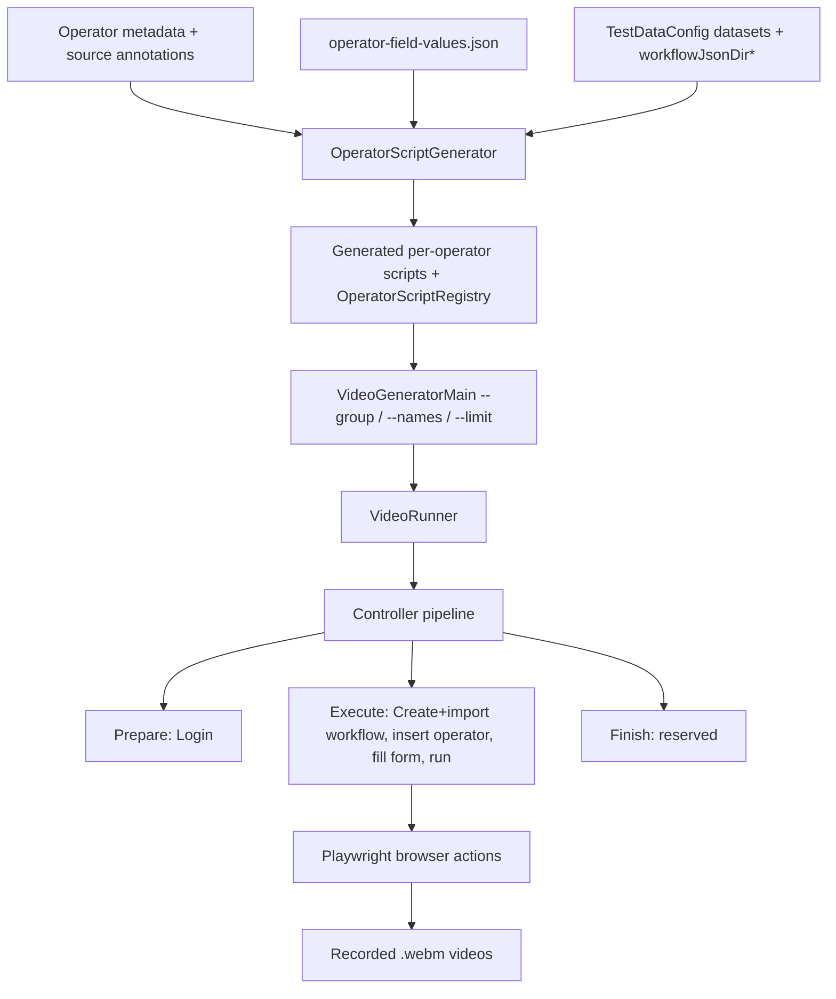

# Texera Docs: Video Generator

Automated pipeline for generating operator demo videos and documentation pages using Playwright.

Each operator gets a self-contained scenario: create workflow, import template, insert operator, fill form values, run execution, open result panel, and save a `.webm` recording.

---

## 1. Prerequisites

- Texera running locally at `http://localhost:4200`
- A registered account (default: `texera` / `texera`)
- sbt installed
- Playwright Chromium browser installed:
  ```bash
  sbt 'Docs/runMain com.microsoft.playwright.CLI install chromium'
  ```

---

## 2. Instructions

### Step 1: Upload the Dataset

Upload the sample dataset into Texera via the Dashboard UI:

1. Go to `http://localhost:4200` and log in
2. Navigate to **Datasets** and create a new dataset named **`sample-dataset`** at version **`v1`**
3. Upload the following files into the dataset:
   - `movies.csv` — 15 columns: name, rating, genre, year, released, score, votes, director, writer, star, country, budget, gross, company, runtime
   - `movie_tree.csv` — 21 columns: edge_list, category, subcategory, title, revenue, budget, pos_x, pos_y, vec_u, vec_v, date, open_week, peak_week, low_week, close_week, prod_start, prod_end, task, predicted, upper_ci, lower_ci

> **If you use a custom dataset name or version**, update:
> - `docs/.../config/TestDataConfig.scala` — `datasets("test1")` and `datasets("test2")` entries
> - `docs/.../config/sample.json` — workflow template references the dataset by name
> - `docs/.../config/sample_tree.json` — same, for movie_tree.csv
> - `docs/.../config/sample_join.json` — same, for join operators
> - `docs/.../config/sample_ML.json` — same, for ML operators

### Step 2: Generate Playwright Scripts

```bash
sbt 'Docs/runMain org.apache.texera.docs.scripts.OperatorScriptGenerator'
```

Scans all registered operators and writes one `<OperatorType>Script.scala` per operator under `docs/.../scripts/operators/<Group>/<Subgroup>/`, plus `OperatorScriptRegistry.scala`.

Re-run after: adding a new operator, changing operator group structure, or modifying `operator-field-values.json` dataset assignments.

### Step 3: Run the Video Generator

```bash
# Run ALL operators
sbt 'Docs/runMain org.apache.texera.docs.VideoGeneratorMain'

# Run a specific group
sbt 'Docs/runMain org.apache.texera.docs.VideoGeneratorMain --group="Data Input"'

# Run specific operators by name
sbt 'Docs/runMain org.apache.texera.docs.VideoGeneratorMain --names=BarChart,PieChart'

# Combine filters
sbt 'Docs/runMain org.apache.texera.docs.VideoGeneratorMain --group=Visualization --names=BarChart'

# Cap the count
sbt 'Docs/runMain org.apache.texera.docs.VideoGeneratorMain --group=Sklearn --limit=5'
```

| Flag | Description | Example |
|------|-------------|---------|
| `--group=<name>` | Filter by operator category (case-insensitive, strips non-alphanumeric) | `--group="Data Input"` |
| `--names=A,B,C` | Filter by operator **user-friendly name** (not operator type), comma-separated | `--names="Bar Chart,Pie Chart"` |
| `--limit=N` | Cap the number of videos generated | `--limit=3` |

Common group names: `Data Input`, `Data Cleaning`, `Visualization Basic`, `Visualization Advanced`, `Visualization Statistical`, `Visualization Scientific`, `Visualization Financial`, `Machine Learning`, `Sklearn`, `Sklearn Training`, `Search`, `Utilities`, `Join`, `Set`

Videos are saved to `docs/generated/videos-demo/` as `.webm` files.

---

## 3. Validation and Debugging

```bash
# Compile
sbt "Docs/compile"

# Validate JSON config syntax
python3 -m json.tool docs/src/main/scala/org/apache/texera/docs/config/operator-field-values.json > /dev/null

# Validate config keys, required fields, and column types against operator schemas
sbt 'Docs/runMain org.apache.texera.docs.scripts.OperatorFieldValuesValidator'

# Debug mode: verbose form-fill logging
TEXERA_DOCS_DEBUG=true sbt 'Docs/runMain org.apache.texera.docs.VideoGeneratorMain --names="Bar Chart"'
```

---

## 4. Architecture

### High-Level Flow



### Core Files

| File | Responsibility |
|------|----------------|
| `scripts/OperatorScriptGenerator.scala` | Generates one script per operator from metadata. Decides workflow template, drag strategy, dataset selection, auto-connect wiring |
| `config/operator-field-values.json` | Per-operator property recommendations. Supports scalar, boolean, array, nested-object-array values |
| `controllers/Controllers.scala` | Playwright controller layer: login, navigation, operator insertion, form filling, execution, result panel, repeat-array handling |
| `config/TestDataConfig.scala` | Environment defaults: base URL, datasets, recording config, JSON template paths |
| `orchestrator/VideoRunner.scala` | Runs scenario list, records each operator video via Playwright Chromium |
| `VideoGeneratorMain.scala` | Unified entry point with `--group`/`--names`/`--limit` filtering and runtime skip list |
| `scripts/OperatorFieldValues.scala` | Loads operator-field-values.json; strips meta-keys (`dataset`) before form fill; provides `datasetKey()` for template selection |
| `scripts/OperatorFieldValuesValidator.scala` | Schema validation: checks config keys against operator metadata, column types against dataset schemas |

---

## 5. Execution Flow (Per Operator)

### OperatorScript Trait

```scala
trait OperatorScript {
  def operatorName: String    // "Bar Chart"
  def category: String        // "Basic"
  def outputFileName: String  // "bar-chart_demo.webm"

  def prepare(ctx): Unit      // login
  def execute(ctx): Unit      // core operations
  def finish(ctx): Unit       // cleanup (currently no-op)
}
```

### Phase Breakdown

1. **Prepare** — `LoginControllerBuilder.login()`
2. **Execute**
   - `createNewWorkflow()` — navigates to a fresh workflow
   - `importWorkflow(template)` — imports the appropriate JSON template; auto-cleans stale operators if any remain on canvas
   - `insertViaDrag(operatorName)` — drags operator from sidebar, auto-connects to anchor operator
   - Dataset selection (Data Input operators) — `DatasetControllerBuilder` opens modal, selects dataset/version/file
   - Form fill — `FormControllerBuilder.fillFieldJsonValues()` from operator-field-values.json; falls back to `autoFillFields()` if no config entry
   - `runWorkflowAndWait()` — ensures computing unit ready, clicks Run, waits for state transition back to `Run`
   - `openResultPanel()` — expands result panel for video capture; avoids toggling off "remove view result"
3. **Finish** — no-op (reserved for future post-actions)

### Typical Flow: Visualization Operator

```
1. LoginControllerBuilder.login("texera", "texera")

2. NavigationControllerBuilder
   ├─ createNewWorkflow()
   └─ importWorkflow("config/sample.json")      → CSVFileScan template

3. OperatorControllerBuilder
   └─ insertViaDrag("Bar Chart", operatorType="BarChart",
        dragNextTo="CSVFileScan-operator-", autoConnectToAnchor=true)

4. FormControllerBuilder
   └─ fillFieldJsonValues(configured)            → from operator-field-values.json

5. ExecutionControllerBuilder
   ├─ enableViewResult()
   ├─ runWorkflowAndWait()
   └─ openResultPanel()
```

### Typical Flow: Join Operator (2 inputs)

```
1. LoginControllerBuilder.login("texera", "texera")

2. NavigationControllerBuilder
   ├─ createNewWorkflow()
   └─ importWorkflow("config/sample_join.json")  → CSV → Split (2 outputs)

3. OperatorControllerBuilder
   └─ insertViaDrag("Hash Join",
        dragNextTo="Split-operator-", autoConnectToAnchor=true,
        fromPortIndex=0, toPortIndex=0,
        connectAdditionalFrom="Split-operator-",
        connectAdditionalFromPortIndex=1, connectAdditionalToInputIndex=1)

4. FormControllerBuilder
   └─ fillFieldJsonValues(configured)

5. ExecutionControllerBuilder
   ├─ enableViewResult()
   ├─ runWorkflowAndWait()
   └─ openResultPanel()
```

---

## 6. Controller Builders

All builders inherit from `ControllerBuilder`, accumulate `ControllerStep` instances, then call `execute()` to run them sequentially.

```
ControllerBuilder (abstract)
  │
  ├─ LoginControllerBuilder        → login(), logout()
  │
  ├─ NavigationControllerBuilder   → createNewWorkflow(), importWorkflow(), cleanWorkflow()
  │
  ├─ OperatorControllerBuilder     → insertViaDrag(), connectOperators(), selectOperatorOnCanvas()
  │    └─ tryAutoConnect()          → SVG port drag-to-connect
  │    └─ findNodeByType()          → find operator node on canvas by type/name/label
  │    └─ collectPortCenters()      → extract port positions from JointJS SVG
  │
  ├─ DatasetControllerBuilder      → datasetName(), datasetVersion(), file(), versionOnly()
  │    └─ open dataset modal → select dataset → select version → [select file] → confirm
  │
  ├─ FormControllerBuilder         → fillFieldJsonValues(), autoFillFields(), fillField()
  │    └─ resolveField()            → locate formly-field elements by label matching
  │    └─ fillArrayItemsNow()       → expand and fill array fields
  │    └─ FormHelpers               → tryFillSelect(), tryFillText(), trySetBoolean()
  │    └─ LLMFormRecovery           → AI-assisted field location fallback (optional)
  │
  └─ ExecutionControllerBuilder    → runWorkflowAndWait(), openResultPanel(), enableViewResult()
       └─ ensureComputingUnitReady() → create or select computing unit
```

### Connection Strategy by Operator Type

| Type | Strategy |
|------|----------|
| Visualization / Data Cleaning (1 input) | `dragNextTo = Some("CSVFileScan-operator-")`, auto-connect |
| Join / Set ops (2+ inputs) | `dragNextTo = Some("Split-operator-")`, auto-connect port 0, connect additional from Split output 1 → port 1 |
| ML (1 input) | `dragNextTo = Some("Split-operator-")`, auto-connect, `yOffset = -110.0` |
| ML (2+ inputs, train/test) | `dragNextTo = Some("Split-operator-")`, port 0 → train, additional port 1 → test |
| Data Input | `canvasPosition = (0.30, 0.30)`, standalone placement |

### Dataset Selection Modes

`DatasetControllerBuilder` supports two modes:
- **File mode** (default) — opens "Select File" modal, selects dataset → version → file in tree → confirm. Used by `CSVFileScan`, `ArrowSource`, `JSONLFileScan`, `CSVOldFileScan`.
- **Version-only mode** (`.versionOnly()`) — opens "Select Dataset" modal, selects dataset → version → confirm (no file tree). Used by `FileLister`.

---

## 7. Form Filling Strategy

### Field Resolution

For each config key, `labelCandidates()` builds candidate labels from:
1. Schema titles from operator metadata (most authoritative, including nested schema traversal)
2. Targeted alias fallbacks for nested configs (e.g., `originalAttribute` → `Attribute`)
3. Pretty-printed camelCase key as last resort

Then resolves the deepest visible `formly-field` with a matching label.

### Control Types

Fills by detected control — `nz-select` dropdowns, `input`/`textarea` text fields, `checkbox`/`switch` booleans. Booleans are filled first (they often toggle visibility of dependent fields).

### Array / Nested Object Handling

`fillFieldJsonValues` detects array-of-object values and calls `fillArrayItemsNow`:
- clicks `+` to create repeat rows as needed
- resolves row/subfield scopes
- fills each subfield value
- uses retry logic for async dropdown availability after schema propagation

Example config patterns:
```json
{
  "Filter": {
    "predicates": [
      { "attribute": "score", "condition": ">", "value": "7.0" }
    ]
  },
  "Projection": {
    "isDrop": false,
    "attributes": [
      { "originalAttribute": "name", "alias": "movie_name" }
    ]
  },
  "ContinuousErrorBands": {
    "dataset": "test2",
    "bands": [
      { "x": "revenue", "y": "predicted", "yUpper": "upper_ci", "yLower": "lower_ci" }
    ]
  }
}
```

---

## 8. VideoRunner

- **`loginOnce`**: First login to obtain `storageState` (session cookie JSON). If login fails, falls back to per-scenario Prepare login.
- **`generateSingleVideo`**: For each scenario, creates a new BrowserContext with recording enabled.
  - If storageState exists, Prepare steps (login) are skipped
  - Recording dimensions: **1440 x 900**, slowMo: **400ms**
  - Result screen hold time: **5000ms**
  - Video saved as Playwright's auto-named `.webm`, then renamed to `{operator-slug}_demo.webm`

---

## 9. OperatorScriptGenerator

Automatically generates `XxxScript.scala` files for each registered operator.

```
OperatorMetadataGenerator.allOperatorMetadata
        │
        ▼
   foreach operator:
        ├─ Determine group (Visualization / ML / DataCleaning / DataInput)
        ├─ Pick workflow JSON template
        ├─ Check if data input operator needs dataset selection
        ├─ Compute autoFillKeys from schema (required + autofill-annotated fields)
        ├─ Generate dragNextTo / autoConnect parameters
        └─ Output .scala file to operators/{Category}/XxxScript.scala
```

Also regenerates `OperatorScriptRegistry.scala` with all script objects.

---

## 10. Workflow Templates

| Template | Source Setup | Used By |
|----------|-------------|---------|
| `sample.json` | Single CSVFileScan → movies.csv | Most visualization, data cleaning, utilities |
| `sample_tree.json` | Single CSVFileScan → movie_tree.csv | Operators with `"dataset": "test2"` (hierarchy, timeline, financial charts) |
| `sample_join.json` | CSVFileScan → Split (2 outputs) | Join and set operators (2-input) |
| `sample_ML.json` | CSVFileScan → Split (train/test) | ML training and prediction operators |

---

## 11. Configuration

### Adding a New Operator

1. Add the operator's form field values to `operator-field-values.json` under the operator type key
   - Use column names from the dataset schema (see `"datasets"` section at the top of the file)
   - Add `"dataset": "test2"` if the operator needs movie_tree.csv columns (hierarchy, timestamps, CI bands, vectors)
2. Re-run the script generator (Step 2)
3. Test: `sbt 'Docs/runMain org.apache.texera.docs.VideoGeneratorMain --names="Operator Name"'`

### Runtime Skip List

`VideoGeneratorMain` excludes operators that crash or time out on the current datasets:
- Gaussian Naive Bayes — rejects sparse matrices from CountVectorizer/TfidfTransformer
- Linear Regression — PolynomialFeatures fails on text columns without countVectorizer
- Gradient Boosting / Training: Gradient Boosting — too slow on high-dim sparse TF-IDF

### Dataset Schemas

**test1** (`movies.csv`): name(string), rating(string), genre(string), year(integer), released(string), score(double), votes(integer), director(string), writer(string), star(string), country(string), budget(double), gross(double), company(string), runtime(double)

**test2** (`movie_tree.csv`): edge_list(string), category(string), subcategory(string), title(string), revenue(double), budget(double), pos_x(double), pos_y(double), vec_u(double), vec_v(double), date(timestamp), open_week(double), peak_week(double), low_week(double), close_week(double), prod_start(timestamp), prod_end(timestamp), task(string), predicted(double), upper_ci(double), lower_ci(double)

---

## 12. TODO

1. **SklearnPrediction / SklearnTesting need a training-operator template** — both expect a `model` column (binary blob from SklearnTraining* upstream). The `sample_ML.json` template has no training operator, so these always fail at runtime.

2. **Data Input operators need additional file types** — the current sample dataset only contains `.csv` files. Additional file formats (`.arrow`, `.jsonl`, plain text) are available but still being tested for compatibility with the video generation pipeline:
   - **ArrowSource** — requires a `.arrow` (Apache Arrow) file
   - **JSONLFileScan** — requires a `.jsonl` (JSON Lines) file
   - **FileScan / FileScanOp** — requires a plain text or binary file

3. **Remaining group coverage** — continue validation passes for: Control Block, Database Connector, External API, User Defined Functions.

4. **Regenerate visualization group scripts and videos** — re-run `OperatorScriptGenerator` and `VideoGeneratorMain` for all visualization subgroups (Basic, Statistical, Scientific, Financial, Advanced).

6. **Code cleanup** — reduce hardcoded values in controller and script generator code.

7. **Clean up unused code** — remove dead code paths and deprecated helper methods.
